# Data Model: UK Smart Meter Data Consumer Mobile App

> **Template Status**: Live | **Version**: 1.0.0 | **Command**: `/arckit.data-model`

## Document Control

| Field | Value |
|-------|-------|
| **Document ID** | ARC-001-DATA-v1.0 |
| **Document Type** | Data Model |
| **Project** | UK Smart Meter Data Consumer Mobile App (Project 001) |
| **Classification** | OFFICIAL |
| **Status** | DRAFT |
| **Version** | 1.0 |
| **Created Date** | 2026-02-01 |
| **Last Modified** | 2026-02-01 |
| **Review Cycle** | Monthly |
| **Next Review Date** | 2026-03-03 |
| **Owner** | Technical Architect |
| **Reviewed By** | PENDING |
| **Approved By** | PENDING |
| **Distribution** | Programme Board, Delivery Team, Architecture Team, DPO, DCC, Ofgem |

## Revision History

| Version | Date | Author | Changes | Approved By | Approval Date |
|---------|------|--------|---------|-------------|---------------|
| 1.0 | 2026-02-01 | ArcKit AI | Initial creation from `/arckit.data-model` command | PENDING | PENDING |

---

## Executive Summary

### Overview

This document defines the comprehensive data model for the UK Smart Meter Data Consumer Mobile App, a cross-platform mobile application that enables 34 million smart meter households to access, visualise, and act upon their half-hourly energy consumption data. The model covers consumer identity, meter linkage, consent management, time-series consumption readings, tariff comparison, budgeting, notifications, carbon intensity, and audit logging.

The data model is designed for a time-series-dominant workload where consumption readings constitute over 99% of total data volume, growing from 36 billion readings in Year 1 to 150 billion cumulative by Year 3 (~50 TB). The architecture employs TimescaleDB (PostgreSQL extension) for consumption data with hot/warm/cold storage tiering, and standard PostgreSQL for transactional entities. All personal data is classified CONFIDENTIAL or RESTRICTED and resides exclusively in UK data centres, compliant with UK GDPR, Smart Energy Code (SEC), and the programme's architecture principles.

The model traces directly to data requirements DR-001 through DR-005 defined in ARC-001-REQ-v1.0, and extends coverage to additional entities identified from functional requirements (budgets, alerts, notifications, recommendations, carbon intensity, feedback, and audit logging).

### Model Statistics
- **Total Entities**: 12 entities defined (E-001 through E-012)
- **Total Attributes**: 108 attributes across all entities
- **Total Relationships**: 15 relationships mapped
- **Data Classification**:
  - 🟡 Internal: 2 entities (E-005 Tariff, E-010 Carbon Intensity)
  - 🟠 Confidential: 8 entities (E-001, E-002, E-004, E-006, E-007, E-008, E-009, E-011) — 3 contain PII
  - 🔴 Restricted: 2 entities (E-003 Consent Record, E-012 Audit Log)

### Compliance Summary
- **GDPR/DPA 2018 Status**: NEEDS_DPIA
- **PII Entities**: 3 entities contain personally identifiable information (E-001 Consumer Profile, E-002 Linked Meter, E-011 Feedback)
- **Data Protection Impact Assessment (DPIA)**: REQUIRED — large-scale processing of energy consumption data reveals household behaviour patterns
- **Data Retention**: 7 years maximum (consent records and audit logs, driven by SEC and ICO audit requirements)
- **Cross-Border Transfers**: NO — all data hosted in UK data centres only (Principle P8: Data Sovereignty)

### Key Data Governance Stakeholders
- **Data Owner (Business)**: DESNZ Programme Director — Accountable for data quality and usage
- **Data Steward**: DPO / Privacy Lead — Responsible for data governance policies and GDPR compliance
- **Data Custodian (Technical)**: Technical Architect / Database Team — Manages data storage and security
- **Data Protection Officer**: DPO / Privacy Lead — Ensures privacy compliance and DPIA maintenance

---

## Visual Entity-Relationship Diagram (ERD)

```mermaid
erDiagram
    CONSUMER_PROFILE ||--o{ LINKED_METER : "owns"
    CONSUMER_PROFILE ||--o{ CONSENT_RECORD : "grants"
    CONSUMER_PROFILE ||--o{ BUDGET_ALERT : "configures"
    CONSUMER_PROFILE ||--o{ NOTIFICATION_PREFERENCE : "sets"
    CONSUMER_PROFILE ||--o{ RECOMMENDATION : "receives"
    CONSUMER_PROFILE ||--o{ FEEDBACK : "submits"
    LINKED_METER ||--o{ CONSUMPTION_READING : "generates"
    LINKED_METER ||--o{ BUDGET_ALERT : "monitors"
    TARIFF }o--|| SUPPLIER : "offered_by"
    BUDGET_ALERT ||--o{ NOTIFICATION_LOG : "triggers"
    CONSUMPTION_READING }o--o| CARBON_INTENSITY : "mapped_to"

    CONSUMER_PROFILE {
        uuid consumer_id PK "Unique identifier"
        string email UK "Contact email (PII)"
        string display_name "Chosen display name (PII)"
        timestamp created_at "Account creation (UTC)"
        timestamp last_login "Last authentication (UTC)"
        enum status "active|suspended|deleted"
        boolean mfa_enabled "MFA status"
        string password_hash "Bcrypt hash"
        timestamp updated_at "Last modification (UTC)"
    }

    LINKED_METER {
        uuid link_id PK "Unique link identifier"
        uuid consumer_id FK "Consumer reference"
        string mpan "Electricity MPAN (PII)"
        string mprn "Gas MPRN (PII)"
        enum meter_type "SMETS1|SMETS2"
        enum payment_type "credit|prepayment"
        string supplier_id "Energy supplier ID"
        timestamp linked_at "Link creation (UTC)"
        enum status "active|unlinked|error"
        timestamp updated_at "Last modification (UTC)"
    }

    CONSENT_RECORD {
        uuid consent_id PK "Unique consent record"
        uuid consumer_id FK "Consumer reference"
        enum purpose "viewing|recommendations|tariff_comparison|research"
        enum status "granted|withdrawn"
        timestamp granted_at "Consent grant time (UTC)"
        timestamp withdrawn_at "Consent withdrawal time (UTC)"
        string version "Privacy notice version"
        string ip_address "Request origin"
        string user_agent "Device/browser"
    }

    CONSUMPTION_READING {
        uuid reading_id PK "Unique reading identifier"
        uuid link_id FK "Meter link reference"
        timestamp reading_timestamp "Half-hour period start (UTC)"
        decimal value_kwh "Consumption in kWh"
        enum fuel_type "electricity|gas"
        enum source "dcc|supplier_name"
        enum quality "actual|estimated|missing"
        timestamp ingested_at "Ingestion time (UTC)"
    }

    TARIFF {
        uuid tariff_id PK "Unique tariff identifier"
        string supplier_id "Supplier reference"
        string tariff_name "Display name"
        enum fuel_type "electricity|gas|dual"
        decimal unit_rate_pence "p/kWh"
        decimal standing_charge_pence "Daily pence"
        enum payment_type "direct_debit|prepayment|variable"
        integer green_percentage "Renewable %"
        date valid_from "Start date"
        date valid_to "End date"
        timestamp last_updated "Refresh time (UTC)"
    }

    BUDGET_ALERT {
        uuid alert_id PK "Unique alert identifier"
        uuid consumer_id FK "Consumer reference"
        uuid link_id FK "Meter link reference"
        decimal budget_amount "Monthly budget"
        enum budget_unit "gbp|kwh"
        enum fuel_type "electricity|gas|combined"
        integer threshold_50_pct "50% notification"
        integer threshold_75_pct "75% notification"
        integer threshold_90_pct "90% notification"
        boolean is_active "Alert enabled"
        timestamp created_at "Creation time (UTC)"
    }

    RECOMMENDATION {
        uuid recommendation_id PK "Unique identifier"
        uuid consumer_id FK "Consumer reference"
        string title "Recommendation title"
        string description "Detailed recommendation"
        decimal estimated_saving_gbp "Annual saving estimate"
        enum status "active|dismissed|completed"
        timestamp generated_at "Generation time (UTC)"
        timestamp actioned_at "Consumer action time"
    }

    NOTIFICATION_PREFERENCE {
        uuid preference_id PK "Unique identifier"
        uuid consumer_id FK "Consumer reference"
        boolean push_enabled "Push notifications"
        boolean email_enabled "Email notifications"
        boolean budget_alerts "Budget alert toggle"
        boolean usage_alerts "Unusual usage toggle"
        boolean prepayment_alerts "Low credit toggle"
        decimal prepayment_threshold_gbp "Low credit threshold"
        timestamp updated_at "Last modification (UTC)"
    }

    NOTIFICATION_LOG {
        uuid notification_id PK "Unique identifier"
        uuid consumer_id FK "Consumer reference"
        uuid alert_id FK "Triggering alert"
        enum channel "push|email"
        enum notification_type "budget|usage|prepayment|system"
        string title "Notification title"
        enum delivery_status "sent|delivered|failed"
        timestamp sent_at "Dispatch time (UTC)"
        timestamp delivered_at "Delivery confirmation"
    }

    CARBON_INTENSITY {
        uuid intensity_id PK "Unique identifier"
        string region_code "Grid region"
        timestamp period_start "Half-hour start (UTC)"
        decimal intensity_gco2_kwh "gCO2/kWh"
        string generation_mix "JSON generation breakdown"
        timestamp fetched_at "API fetch time (UTC)"
    }

    FEEDBACK {
        uuid feedback_id PK "Unique identifier"
        uuid consumer_id FK "Consumer reference"
        enum feedback_type "bug|feature|general"
        string description "Feedback text"
        string app_version "App version"
        string device_type "Device model"
        string os_version "OS version"
        timestamp submitted_at "Submission time (UTC)"
    }

    AUDIT_LOG {
        uuid log_id PK "Unique identifier"
        string actor_id "User or service ID"
        enum actor_type "consumer|admin|system|support"
        string action "Action performed"
        string entity_type "Target entity"
        string entity_id "Target record ID"
        string correlation_id "Session/request ID"
        string component "Service component"
        enum result "success|failure"
        string detail "Additional context"
        timestamp occurred_at "Event time (UTC)"
        string hash "Tamper-evidence hash"
    }
```

**Diagram Notes**:
- **Cardinality**: `||` = exactly one, `o{` = zero or more, `|{` = one or more
- **Primary Keys (PK)**: Uniquely identify each record
- **Foreign Keys (FK)**: Reference other entities
- **Unique Keys (UK)**: Must be unique but not primary identifier
- Supplier is referenced by string ID (not a managed entity — sourced from external tariff data provider)

---

## Entity Catalog

### Entity E-001: Consumer Profile

**Description**: Consumer account and authentication information for citizens using the smart meter app.

**Source Requirements**:
- DR-001: Consumer Profile Entity — consumer identity and authentication
- FR-001: Consumer Account Registration
- UC-1: Consumer Onboarding and Meter Linking

**Business Context**: The core identity entity. Created during onboarding when a citizen registers. Used for authentication, personalisation, consent tracking, and data subject rights fulfilment. Every consumer interaction traces back to this entity.

**Data Ownership**:
- **Business Owner**: Programme Director (DESNZ) — Accountable for consumer data accuracy and usage
- **Technical Owner**: Identity & Access Management Team — Maintains authentication infrastructure
- **Data Steward**: DPO / Privacy Lead — Enforces GDPR compliance for consumer PII

**Data Classification**: CONFIDENTIAL

**Volume Estimates**:
- **Initial Volume**: 0 records at go-live (new service)
- **Growth Rate**: +650,000 records per month (Year 1 target: 8M downloads)
- **Peak Volume**: 20M records at Year 3
- **Average Record Size**: ~0.5 KB

**Data Retention**:
- **Active Period**: Duration of active account
- **Archive Period**: 12 months post-account deletion
- **Total Retention**: Account lifetime + 12 months (driven by UK GDPR)
- **Deletion Policy**: Hard delete PII within 30 days of deletion request; anonymised audit references retained 7 years

#### Attributes

| Attribute | Type | Required | PII | Description | Validation Rules | Default | Source Req |
|-----------|------|----------|-----|-------------|------------------|---------|------------|
| consumer_id | UUID | Yes | No | Unique consumer identifier | UUID v4 format | Auto-generated | DR-001 |
| email | VARCHAR(255) | Yes | Yes | Consumer email address | RFC 5322, unique, lowercase | None | DR-001 |
| display_name | VARCHAR(100) | No | Yes | Consumer's chosen display name | 1-100 chars, sanitised | NULL | DR-001 |
| password_hash | VARCHAR(255) | Yes | No | Bcrypt password hash | Bcrypt format | None | NFR-SEC-001 |
| created_at | TIMESTAMPTZ | Yes | No | Account creation timestamp | ISO 8601, immutable | NOW() | DR-001 |
| last_login | TIMESTAMPTZ | No | No | Last successful authentication | ISO 8601 | NULL | DR-001 |
| status | VARCHAR(20) | Yes | No | Account status | active, suspended, deleted | 'active' | DR-001 |
| mfa_enabled | BOOLEAN | Yes | No | Multi-factor authentication status | true/false | true | DR-001, NFR-SEC-001 |
| updated_at | TIMESTAMPTZ | Yes | No | Last modification timestamp | ISO 8601, auto-update | NOW() | DR-001 |

**Attribute Notes**:
- **PII Attributes**: email, display_name
- **Encrypted Attributes**: password_hash (bcrypt with cost factor 12); email encrypted at rest via database-level encryption
- **Derived Attributes**: None
- **Audit Attributes**: created_at, updated_at tracked automatically

#### Relationships

**Outgoing Relationships** (this entity references others):
- None (root entity)

**Incoming Relationships** (other entities reference this):
- E-002 (Linked Meter) → E-001: One consumer has zero or more linked meters
- E-003 (Consent Record) → E-001: One consumer has zero or more consent records
- E-006 (Budget Alert) → E-001: One consumer has zero or more budget alerts
- E-007 (Recommendation) → E-001: One consumer has zero or more recommendations
- E-008 (Notification Preference) → E-001: One consumer has exactly one preference record
- E-009 (Notification Log) → E-001: One consumer has zero or more notifications
- E-011 (Feedback) → E-001: One consumer has zero or more feedback entries

#### Indexes

**Primary Key**:
- `pk_consumer_profile` on `consumer_id` (clustered index)

**Unique Constraints**:
- `uk_consumer_profile_email` on `email` (case-insensitive unique)

**Performance Indexes**:
- `idx_consumer_profile_status` on `status` (for active account queries)
- `idx_consumer_profile_last_login` on `last_login` (for inactive account identification)

#### Privacy & Compliance

**GDPR/DPA 2018 Considerations**:
- **Contains PII**: YES
- **PII Attributes**: email, display_name
- **Legal Basis for Processing**: Contract (GDPR Art 6(1)(b)) — processing necessary to provide the service
- **Data Subject Rights**:
  - **Right to Access**: Provide consumer profile via SAR endpoint `/api/v1/subject-access-request`
  - **Right to Rectification**: Consumer can update email and display_name via account settings
  - **Right to Erasure**: Hard delete PII within 30 days; consumer_id retained in anonymised form in audit logs
  - **Right to Portability**: Export in JSON format via `/api/v1/data-export`
  - **Right to Object**: Not applicable (contractual basis)
  - **Right to Restrict Processing**: Support restriction flag — data retained but not used
- **Data Breach Impact**: HIGH — email addresses and account status exposed
- **Cross-Border Transfers**: None — UK data centres only
- **DPIA**: REQUIRED

**Government Security Classification**: OFFICIAL

**Audit Logging**:
- **Access Logging**: Required — log all authentication events
- **Change Logging**: Required — log all profile modifications (before/after values)
- **Retention of Logs**: 7 years for compliance

---

### Entity E-002: Linked Meter

**Description**: Association between a consumer account and their smart meter(s), including meter type, payment method, and energy supplier.

**Source Requirements**:
- DR-002: Linked Meter Entity
- FR-002: Smart Meter Discovery and Linking
- UC-1: Consumer Onboarding and Meter Linking

**Business Context**: Created when a consumer links their smart meter during onboarding. Determines the data retrieval route (DCC for SMETS2, supplier API for SMETS1) and enables consumption data association. Maximum 3 meters per consumer.

**Data Ownership**:
- **Business Owner**: Programme Integration Team — Accountable for meter linkage accuracy
- **Technical Owner**: Integration Team — Maintains DCC/supplier connectivity
- **Data Steward**: DPO / Privacy Lead — MPAN/MPRN are indirect personal identifiers

**Data Classification**: CONFIDENTIAL

**Volume Estimates**:
- **Initial Volume**: 0 records
- **Growth Rate**: ~800,000 records per month (average 1.25 meters per consumer)
- **Peak Volume**: 30M records at Year 3
- **Average Record Size**: ~0.3 KB

**Data Retention**:
- **Active Period**: Duration of active link
- **Archive Period**: 12 months post-unlink or account deletion
- **Total Retention**: Link lifetime + 12 months
- **Deletion Policy**: Hard delete after retention period

#### Attributes

| Attribute | Type | Required | PII | Description | Validation Rules | Default | Source Req |
|-----------|------|----------|-----|-------------|------------------|---------|------------|
| link_id | UUID | Yes | No | Unique link identifier | UUID v4 | Auto-generated | DR-002 |
| consumer_id | UUID | Yes | No | Consumer reference | FK to E-001 | None | DR-002 |
| mpan | VARCHAR(21) | Conditional | Yes | Electricity Meter Point Admin Number | 13-21 digits, required if electricity | NULL | DR-002 |
| mprn | VARCHAR(15) | Conditional | Yes | Gas Meter Point Reference Number | 6-15 digits, required if gas | NULL | DR-002 |
| meter_type | VARCHAR(10) | Yes | No | Smart meter generation | SMETS1, SMETS2 | None | DR-002 |
| payment_type | VARCHAR(15) | Yes | No | Payment method | credit, prepayment | None | DR-002 |
| supplier_id | VARCHAR(50) | Yes | No | Energy supplier identifier | Non-empty | None | DR-002 |
| linked_at | TIMESTAMPTZ | Yes | No | Link creation timestamp | ISO 8601, immutable | NOW() | DR-002 |
| status | VARCHAR(10) | Yes | No | Link status | active, unlinked, error | 'active' | DR-002 |
| updated_at | TIMESTAMPTZ | Yes | No | Last modification | ISO 8601, auto-update | NOW() | DR-002 |

**Attribute Notes**:
- **PII Attributes**: mpan, mprn (indirect identifiers — can identify a household)
- **Encrypted Attributes**: mpan and mprn encrypted at rest
- **Business Rule**: At least one of mpan or mprn must be populated; maximum 3 active links per consumer

#### Relationships

**Outgoing Relationships**:
- E-002 → E-001 (Consumer Profile): Many-to-one
  - Foreign Key: consumer_id references E-001.consumer_id
  - Cascade Delete: YES — if consumer deleted, unlink meters
  - Orphan Check: REQUIRED — meter link cannot exist without consumer

**Incoming Relationships**:
- E-004 (Consumption Reading) → E-002: One meter link has zero or more readings
- E-006 (Budget Alert) → E-002: One meter link has zero or more budget alerts

#### Indexes

**Primary Key**:
- `pk_linked_meter` on `link_id`

**Foreign Keys**:
- `fk_linked_meter_consumer` on `consumer_id` → E-001.consumer_id (ON DELETE CASCADE)

**Unique Constraints**:
- `uk_linked_meter_mpan_active` on `(mpan, status)` WHERE status = 'active' (partial unique — one active link per MPAN)
- `uk_linked_meter_mprn_active` on `(mprn, status)` WHERE status = 'active'

**Performance Indexes**:
- `idx_linked_meter_consumer_id` on `consumer_id` (consumer's meters lookup)
- `idx_linked_meter_supplier_status` on `(supplier_id, status)` (supplier integration queries)

#### Privacy & Compliance

**GDPR/DPA 2018 Considerations**:
- **Contains PII**: YES (MPAN/MPRN are indirect household identifiers)
- **PII Attributes**: mpan, mprn
- **Legal Basis for Processing**: Contract (GDPR Art 6(1)(b)) — necessary to retrieve meter data
- **Data Subject Rights**:
  - **Right to Access**: Include linked meters in SAR response
  - **Right to Erasure**: Hard delete on account deletion
  - **Right to Portability**: Export meter link data in JSON/CSV
- **Data Breach Impact**: MEDIUM — MPANs/MPRNs alone do not directly identify individuals
- **SEC Compliance**: Meter data access governed by Smart Energy Code; consumer consent verified before DCC/supplier requests

**Government Security Classification**: OFFICIAL

---

### Entity E-003: Consent Record

**Description**: Immutable record of consumer consent decisions for each data processing purpose, supporting granular consent management and regulatory audit.

**Source Requirements**:
- DR-003: Consent Record Entity
- FR-003: Granular Consent Management
- UC-7: Manage Data Consent

**Business Context**: Central to UK GDPR compliance. Each consent decision (grant or withdrawal) for each purpose creates a new immutable record. Consent records are never updated — new records are appended. This provides a complete, tamper-evident audit trail of all consent changes, required by ICO and SEC.

**Data Ownership**:
- **Business Owner**: DPO / Privacy Lead — Accountable for consent integrity
- **Technical Owner**: Identity & Consent Service Team
- **Data Steward**: DPO / Privacy Lead

**Data Classification**: RESTRICTED (regulatory audit requirement)

**Volume Estimates**:
- **Initial Volume**: 0 records
- **Growth Rate**: ~5 consent records per consumer at registration + changes over time
- **Peak Volume**: 100M records at Year 3
- **Average Record Size**: ~0.4 KB

**Data Retention**:
- **Active Period**: 7 years from record creation (regulatory audit)
- **Archive Period**: N/A — retained in primary storage for audit access
- **Total Retention**: 7 years (driven by SEC and ICO audit requirements)
- **Deletion Policy**: Hard delete after 7 years; never deleted during active account even if consent withdrawn

#### Attributes

| Attribute | Type | Required | PII | Description | Validation Rules | Default | Source Req |
|-----------|------|----------|-----|-------------|------------------|---------|------------|
| consent_id | UUID | Yes | No | Unique consent record identifier | UUID v4 | Auto-generated | DR-003 |
| consumer_id | UUID | Yes | No | Consumer reference | FK to E-001 | None | DR-003 |
| purpose | VARCHAR(30) | Yes | No | Processing purpose | viewing, recommendations, tariff_comparison, research | None | DR-003 |
| status | VARCHAR(15) | Yes | No | Consent status | granted, withdrawn | None | DR-003 |
| granted_at | TIMESTAMPTZ | Conditional | No | Consent grant timestamp | Required if status=granted | NULL | DR-003 |
| withdrawn_at | TIMESTAMPTZ | Conditional | No | Consent withdrawal timestamp | Required if status=withdrawn | NULL | DR-003 |
| version | VARCHAR(10) | Yes | No | Privacy notice version consented to | Semver format | None | DR-003 |
| ip_address | VARCHAR(45) | No | No | Request origin IP (hashed) | IPv4/IPv6 format, stored hashed | NULL | NFR-C-004 |
| user_agent | VARCHAR(255) | No | No | Device/browser identifier | Sanitised string | NULL | NFR-C-004 |
| created_at | TIMESTAMPTZ | Yes | No | Record creation timestamp | ISO 8601, immutable | NOW() | DR-003 |

**Attribute Notes**:
- **Immutability**: Consent records are append-only. No UPDATE or DELETE operations permitted on this table during retention period.
- **PII Attributes**: None directly (consumer_id is a pseudonymous identifier; ip_address stored as hash)

#### Relationships

**Outgoing Relationships**:
- E-003 → E-001 (Consumer Profile): Many-to-one
  - Foreign Key: consumer_id references E-001.consumer_id
  - Cascade Delete: NO — consent records retained even after account deletion (regulatory requirement)
  - Note: On account deletion, consumer_id is retained but PII in E-001 is deleted (pseudonymous reference)

#### Indexes

**Primary Key**:
- `pk_consent_record` on `consent_id`

**Foreign Keys**:
- `fk_consent_record_consumer` on `consumer_id` → E-001.consumer_id (ON DELETE RESTRICT)

**Performance Indexes**:
- `idx_consent_record_consumer_purpose` on `(consumer_id, purpose, created_at DESC)` (latest consent per purpose)
- `idx_consent_record_created_at` on `created_at` (audit time-range queries)

#### Privacy & Compliance

**GDPR/DPA 2018 Considerations**:
- **Contains PII**: NO (consumer_id is pseudonymous; IP address hashed)
- **Legal Basis for Processing**: Legal Obligation (GDPR Art 6(1)(c)) — required to demonstrate compliance with consent requirements
- **Data Subject Rights**:
  - **Right to Access**: Include consent history in SAR response
  - **Right to Erasure**: Consent records are EXEMPT from erasure — legal obligation to retain for regulatory audit (GDPR Art 17(3)(b))
- **Data Breach Impact**: LOW — no direct PII; consent status alone does not identify individuals
- **Audit Requirements**: Immutable append-only storage; cryptographic hash chain for tamper evidence

**Government Security Classification**: OFFICIAL

---

### Entity E-004: Consumption Reading

**Description**: Half-hourly energy consumption readings from smart meters, forming the core time-series dataset of the application.

**Source Requirements**:
- DR-004: Consumption Reading Entity
- FR-004: Half-Hourly Consumption Data Retrieval
- FR-005: Energy Consumption Dashboard
- UC-2: View Energy Consumption Dashboard

**Business Context**: The highest-volume entity in the system. Each linked smart meter generates 48 readings per day (one per half-hour) for each fuel type. This data powers the consumption dashboard, recommendations, tariff comparison, budget tracking, and carbon footprint features. Consumption data reveals household behaviour patterns and is classified CONFIDENTIAL.

**Data Ownership**:
- **Business Owner**: Programme Director — Accountable for data accuracy and consumer value
- **Technical Owner**: Data Engineering Team — Manages ingestion pipeline and TimescaleDB
- **Data Steward**: DPO / Privacy Lead — Consumption patterns constitute personal data

**Data Classification**: CONFIDENTIAL (reveals household behaviour patterns)

**Volume Estimates**:
- **Initial Volume**: Up to 13 months historical per meter on linking (DCC SMETS2)
- **Growth Rate**: ~100M readings per day (Year 1: 5M users × 48 readings × ~0.4 fuels average active)
- **Peak Volume**: ~150 billion readings cumulative at Year 3
- **Average Record Size**: ~0.1 KB (optimised for time-series compression)
- **Storage**: Year 1: ~10 TB; Year 2: ~25 TB; Year 3: ~50 TB (before compression)

**Data Retention**:
- **Hot Storage**: Last 3 months (fast query, SSD-backed TimescaleDB)
- **Warm Storage**: 3-24 months (query within seconds, standard storage)
- **Cold Storage**: 24+ months (query within minutes, compressed archive)
- **Deletion Policy**: Per consent — if consumer withdraws viewing consent, readings deleted within 30 days; if account deleted, readings deleted per retention schedule

#### Attributes

| Attribute | Type | Required | PII | Description | Validation Rules | Default | Source Req |
|-----------|------|----------|-----|-------------|------------------|---------|------------|
| reading_id | UUID | Yes | No | Unique reading identifier | UUID v4 | Auto-generated | DR-004 |
| link_id | UUID | Yes | No | Meter link reference | FK to E-002 | None | DR-004 |
| reading_timestamp | TIMESTAMPTZ | Yes | No | Half-hour period start | UTC, 30-minute aligned | None | DR-004 |
| value_kwh | DECIMAL(10,4) | Yes | No | Consumption in kWh | >= 0, < 100 (flag if >= 100) | None | DR-004 |
| fuel_type | VARCHAR(15) | Yes | No | Fuel type | electricity, gas | None | DR-004 |
| source | VARCHAR(50) | Yes | No | Data source | dcc, or supplier name | None | DR-004 |
| quality | VARCHAR(15) | Yes | No | Data quality flag | actual, estimated, missing | None | DR-004 |
| ingested_at | TIMESTAMPTZ | Yes | No | Ingestion pipeline timestamp | ISO 8601 | NOW() | DR-004 |

**Attribute Notes**:
- **PII Attributes**: None directly, but readings associated via link_id to a consumer constitute personal data (household behaviour inference)
- **Derived Attributes**: Cost estimates calculated at query time using tariff data (not stored)
- **Gas Conversion**: Gas readings stored in kWh after m³ to kWh conversion during ingestion (conversion factor logged)
- **TimescaleDB**: This entity is implemented as a TimescaleDB hypertable, partitioned by reading_timestamp with chunk intervals aligned to the hot/warm/cold tiering

#### Relationships

**Outgoing Relationships**:
- E-004 → E-002 (Linked Meter): Many-to-one
  - Foreign Key: link_id references E-002.link_id
  - Cascade Delete: YES — if meter unlinked and retention period elapsed, readings deleted
  - Note: Readings are immutable once ingested; corrections create new records with quality='estimated'

**Incoming Relationships**:
- None (leaf entity in the relationship graph)

#### Indexes

**Primary Key**:
- `pk_consumption_reading` on `reading_id`

**Foreign Keys**:
- `fk_consumption_reading_link` on `link_id` → E-002.link_id (ON DELETE CASCADE)

**Performance Indexes**:
- `idx_consumption_reading_link_ts` on `(link_id, reading_timestamp DESC)` (primary consumer query: my readings by date)
- `idx_consumption_reading_fuel_ts` on `(link_id, fuel_type, reading_timestamp DESC)` (fuel-specific queries)
- `idx_consumption_reading_quality` on `(link_id, quality)` WHERE quality != 'actual' (data gap identification)

**TimescaleDB-Specific**:
- Hypertable partitioned by `reading_timestamp` with 1-week chunk intervals
- Compression enabled on chunks older than 3 months (95% compression ratio expected)
- Continuous aggregates for daily, weekly, monthly summaries

#### Privacy & Compliance

**GDPR/DPA 2018 Considerations**:
- **Contains PII**: YES (indirectly — consumption patterns reveal household behaviour)
- **Legal Basis for Processing**: Consent (GDPR Art 6(1)(a)) — consumer explicitly consents to data retrieval and viewing
- **Data Subject Rights**:
  - **Right to Access**: Include consumption data in SAR response (machine-readable CSV)
  - **Right to Erasure**: Delete readings within 30 days of request
  - **Right to Portability**: Export in CSV/JSON with documented schema
  - **Right to Restrict Processing**: Freeze readings (retain but do not use for recommendations/comparisons)
- **Data Breach Impact**: HIGH — consumption patterns can reveal when a household is occupied/vacant, sleep patterns, appliance usage
- **SEC Compliance**: Data retrieved under SEC framework; consumer consent verified before each DCC request

**Government Security Classification**: OFFICIAL

---

### Entity E-005: Tariff

**Description**: Energy tariff information from all suppliers, used for impartial tariff comparison based on actual consumption data.

**Source Requirements**:
- DR-005: Tariff Entity
- FR-007: Tariff Comparison
- UC-4: Compare Tariffs

**Business Context**: Sourced from an Ofgem-endorsed tariff data provider via daily batch ingestion. Enables consumers to compare their current tariff against all available alternatives using their actual half-hourly consumption profile. Tariff data is publicly available information and does not contain PII.

**Data Ownership**:
- **Business Owner**: Programme Commercial Team — Accountable for tariff data accuracy and impartiality
- **Technical Owner**: Data Engineering Team — Manages ingestion pipeline
- **Data Steward**: Programme Commercial Team — Ensures Ofgem methodology compliance

**Data Classification**: INTERNAL (publicly available information)

**Volume Estimates**:
- **Initial Volume**: ~5,000 active tariffs
- **Growth Rate**: Minimal (~100 new tariffs per month, old tariffs expired)
- **Peak Volume**: ~50,000 total records (active + 24 months historical)
- **Average Record Size**: ~0.5 KB

**Data Retention**:
- **Active Period**: Duration of tariff validity
- **Archive Period**: 24 months after tariff expiry (for historical comparison accuracy)
- **Total Retention**: Validity period + 24 months
- **Deletion Policy**: Hard delete after retention period

#### Attributes

| Attribute | Type | Required | PII | Description | Validation Rules | Default | Source Req |
|-----------|------|----------|-----|-------------|------------------|---------|------------|
| tariff_id | UUID | Yes | No | Unique tariff identifier | UUID v4 | Auto-generated | DR-005 |
| supplier_id | VARCHAR(50) | Yes | No | Supplier reference | Non-empty | None | DR-005 |
| tariff_name | VARCHAR(255) | Yes | No | Tariff display name | Non-empty | None | DR-005 |
| fuel_type | VARCHAR(15) | Yes | No | Fuel type | electricity, gas, dual | None | DR-005 |
| unit_rate_pence | DECIMAL(8,4) | Yes | No | Unit rate in p/kWh | > 0 | None | DR-005 |
| standing_charge_pence | DECIMAL(8,4) | Yes | No | Daily standing charge in pence | >= 0 | None | DR-005 |
| payment_type | VARCHAR(20) | Yes | No | Payment method | direct_debit, prepayment, variable | None | DR-005 |
| green_percentage | INTEGER | No | No | Renewable energy percentage | 0-100 | NULL | DR-005 |
| valid_from | DATE | Yes | No | Tariff start date | Valid date | None | DR-005 |
| valid_to | DATE | No | No | Tariff end date | NULL = ongoing, must be >= valid_from | NULL | DR-005 |
| last_updated | TIMESTAMPTZ | Yes | No | Data refresh timestamp | ISO 8601 | NOW() | DR-005 |
| exit_fee_pence | INTEGER | No | No | Early exit fee in pence | >= 0 | NULL | FR-007 |
| tariff_type | VARCHAR(20) | No | No | Tariff category | fixed, variable, tracker, prepayment | NULL | FR-007 |

#### Relationships

**Outgoing Relationships**:
- None (reference data entity — no foreign keys to managed entities)

**Incoming Relationships**:
- None (queried independently by tariff comparison service)

#### Indexes

**Primary Key**:
- `pk_tariff` on `tariff_id`

**Performance Indexes**:
- `idx_tariff_supplier_fuel` on `(supplier_id, fuel_type)` (supplier tariff lookup)
- `idx_tariff_valid_dates` on `(valid_from, valid_to)` (active tariff queries)
- `idx_tariff_payment_fuel` on `(payment_type, fuel_type, valid_to)` (comparison filtering)

#### Privacy & Compliance

- **Contains PII**: NO
- **Legal Basis**: N/A — publicly available information
- **Data Breach Impact**: LOW — no personal data
- **Ofgem Compliance**: Tariff comparison methodology must be transparent and non-discriminatory; all tariffs shown impartially

**Government Security Classification**: OFFICIAL

---

### Entity E-006: Budget Alert

**Description**: Consumer-configured monthly energy budget with threshold alerts for consumption monitoring.

**Source Requirements**:
- FR-008: Consumption Alerts and Notifications
- UC-5: Set and Monitor Budget Alerts
- UC-6: Prepayment Meter Management

**Business Context**: Enables consumers to set spending or consumption targets and receive alerts at configurable thresholds. For prepayment meters, tracks remaining credit. Drives push notifications via E-009 (Notification Log).

**Data Ownership**:
- **Business Owner**: Product Owner — Consumer engagement feature
- **Technical Owner**: Alerting Service Team
- **Data Steward**: DPO / Privacy Lead

**Data Classification**: CONFIDENTIAL

**Volume Estimates**:
- **Initial Volume**: 0 records
- **Growth Rate**: ~1-2 alerts per active consumer
- **Peak Volume**: 30M records at Year 3
- **Average Record Size**: ~0.3 KB

**Data Retention**:
- **Active Period**: Duration of active alert configuration
- **Archive Period**: 12 months post-deactivation or account deletion
- **Total Retention**: Alert lifetime + 12 months
- **Deletion Policy**: Hard delete with account deletion

#### Attributes

| Attribute | Type | Required | PII | Description | Validation Rules | Default | Source Req |
|-----------|------|----------|-----|-------------|------------------|---------|------------|
| alert_id | UUID | Yes | No | Unique alert identifier | UUID v4 | Auto-generated | FR-008 |
| consumer_id | UUID | Yes | No | Consumer reference | FK to E-001 | None | FR-008 |
| link_id | UUID | No | No | Specific meter link (NULL = all meters) | FK to E-002 | NULL | FR-008 |
| budget_amount | DECIMAL(10,2) | Yes | No | Monthly budget value | > 0 | None | UC-5 |
| budget_unit | VARCHAR(5) | Yes | No | Budget unit | gbp, kwh | 'gbp' | UC-5 |
| fuel_type | VARCHAR(15) | Yes | No | Fuel scope | electricity, gas, combined | 'combined' | UC-5 |
| threshold_50 | BOOLEAN | Yes | No | Alert at 50% | true/false | true | FR-008 |
| threshold_75 | BOOLEAN | Yes | No | Alert at 75% | true/false | true | FR-008 |
| threshold_90 | BOOLEAN | Yes | No | Alert at 90% | true/false | true | FR-008 |
| is_active | BOOLEAN | Yes | No | Alert enabled flag | true/false | true | FR-008 |
| created_at | TIMESTAMPTZ | Yes | No | Creation timestamp | ISO 8601 | NOW() | FR-008 |
| updated_at | TIMESTAMPTZ | Yes | No | Last modification | ISO 8601, auto-update | NOW() | FR-008 |

#### Relationships

**Outgoing Relationships**:
- E-006 → E-001: Many-to-one (consumer_id → E-001.consumer_id, ON DELETE CASCADE)
- E-006 → E-002: Many-to-one, optional (link_id → E-002.link_id, ON DELETE SET NULL)

**Incoming Relationships**:
- E-009 (Notification Log) → E-006: One alert triggers zero or more notifications

#### Indexes

**Primary Key**: `pk_budget_alert` on `alert_id`

**Foreign Keys**:
- `fk_budget_alert_consumer` on `consumer_id` → E-001.consumer_id (ON DELETE CASCADE)
- `fk_budget_alert_link` on `link_id` → E-002.link_id (ON DELETE SET NULL)

**Performance Indexes**:
- `idx_budget_alert_consumer_active` on `(consumer_id, is_active)` WHERE is_active = true

#### Privacy & Compliance

- **Contains PII**: NO (budget amounts do not identify individuals)
- **Legal Basis**: Contract (GDPR Art 6(1)(b))
- **Data Breach Impact**: LOW

---

### Entity E-007: Recommendation

**Description**: Personalised energy-saving recommendations generated from consumption pattern analysis.

**Source Requirements**:
- FR-006: Personalised Energy-Saving Recommendations
- UC-3: Receive Energy-Saving Recommendations

**Business Context**: Generated by the recommendation engine after at least 2 weeks of consumption data, requiring consumer consent for the "recommendations" purpose. Recommendations are personalised (not generic) and include estimated annual savings in GBP.

**Data Ownership**:
- **Business Owner**: Product Owner — Consumer engagement feature
- **Technical Owner**: Data Science / ML Team
- **Data Steward**: DPO / Privacy Lead

**Data Classification**: CONFIDENTIAL

**Volume Estimates**:
- **Initial Volume**: 0 records
- **Growth Rate**: ~5-10 recommendations per consumer per month (refreshed monthly)
- **Peak Volume**: ~500M records at Year 3
- **Average Record Size**: ~0.5 KB

**Data Retention**:
- **Active Period**: 12 months from generation
- **Archive Period**: Deleted after active period
- **Deletion Policy**: Hard delete expired recommendations; delete all on consent withdrawal or account deletion

#### Attributes

| Attribute | Type | Required | PII | Description | Validation Rules | Default | Source Req |
|-----------|------|----------|-----|-------------|------------------|---------|------------|
| recommendation_id | UUID | Yes | No | Unique identifier | UUID v4 | Auto-generated | FR-006 |
| consumer_id | UUID | Yes | No | Consumer reference | FK to E-001 | None | FR-006 |
| title | VARCHAR(200) | Yes | No | Recommendation headline | Non-empty | None | FR-006 |
| description | TEXT | Yes | No | Detailed recommendation text | Non-empty | None | FR-006 |
| category | VARCHAR(50) | No | No | Recommendation category | heating, appliance, tariff, behaviour | NULL | FR-006 |
| estimated_saving_gbp | DECIMAL(8,2) | Yes | No | Estimated annual saving in £ | >= 0 | None | FR-006 |
| status | VARCHAR(15) | Yes | No | Consumer action status | active, dismissed, completed, expired | 'active' | UC-3 |
| generated_at | TIMESTAMPTZ | Yes | No | Generation timestamp | ISO 8601 | NOW() | FR-006 |
| actioned_at | TIMESTAMPTZ | No | No | When consumer acted | ISO 8601 | NULL | UC-3 |
| expires_at | TIMESTAMPTZ | Yes | No | Recommendation expiry | ISO 8601 | generated_at + 12 months | FR-006 |

#### Relationships

**Outgoing Relationships**:
- E-007 → E-001: Many-to-one (consumer_id → E-001.consumer_id, ON DELETE CASCADE)

#### Indexes

**Primary Key**: `pk_recommendation` on `recommendation_id`

**Foreign Keys**:
- `fk_recommendation_consumer` on `consumer_id` → E-001.consumer_id (ON DELETE CASCADE)

**Performance Indexes**:
- `idx_recommendation_consumer_status` on `(consumer_id, status, generated_at DESC)` (active recommendations for consumer)

#### Privacy & Compliance

- **Contains PII**: NO (recommendations do not directly identify individuals)
- **Legal Basis**: Consent (GDPR Art 6(1)(a)) — requires "recommendations" consent purpose
- **Data Breach Impact**: MEDIUM — recommendation content reveals household energy usage patterns
- **Consent Dependency**: If consumer withdraws "recommendations" consent, all recommendations deleted within 30 days

---

### Entity E-008: Notification Preference

**Description**: Consumer notification channel preferences and alert configuration.

**Source Requirements**:
- FR-008: Consumption Alerts and Notifications
- UC-5: Set and Monitor Budget Alerts
- UC-6: Prepayment Meter Management

**Business Context**: One record per consumer, controlling which notification channels are enabled and which alert types the consumer wishes to receive.

**Data Classification**: CONFIDENTIAL

**Volume Estimates**:
- **Peak Volume**: 20M records (one per consumer)
- **Average Record Size**: ~0.2 KB

**Data Retention**: Same as E-001 (Consumer Profile) — deleted with account

#### Attributes

| Attribute | Type | Required | PII | Description | Validation Rules | Default | Source Req |
|-----------|------|----------|-----|-------------|------------------|---------|------------|
| preference_id | UUID | Yes | No | Unique identifier | UUID v4 | Auto-generated | FR-008 |
| consumer_id | UUID | Yes | No | Consumer reference | FK to E-001, unique | None | FR-008 |
| push_enabled | BOOLEAN | Yes | No | Push notifications enabled | true/false | true | FR-008 |
| email_enabled | BOOLEAN | Yes | No | Email notifications enabled | true/false | false | FR-008 |
| budget_alerts | BOOLEAN | Yes | No | Budget threshold alerts | true/false | true | UC-5 |
| usage_alerts | BOOLEAN | Yes | No | Unusual usage alerts | true/false | true | FR-008 |
| prepayment_alerts | BOOLEAN | Yes | No | Low credit alerts | true/false | true | UC-6 |
| prepayment_threshold_gbp | DECIMAL(6,2) | No | No | Low credit threshold in £ | > 0, default £5 | 5.00 | UC-6 |
| updated_at | TIMESTAMPTZ | Yes | No | Last modification | ISO 8601, auto-update | NOW() | FR-008 |

#### Relationships

**Outgoing Relationships**:
- E-008 → E-001: One-to-one (consumer_id → E-001.consumer_id, ON DELETE CASCADE)

#### Indexes

**Primary Key**: `pk_notification_preference` on `preference_id`

**Unique Constraints**: `uk_notification_preference_consumer` on `consumer_id`

**Foreign Keys**:
- `fk_notification_preference_consumer` on `consumer_id` → E-001.consumer_id (ON DELETE CASCADE)

---

### Entity E-009: Notification Log

**Description**: Record of all notifications dispatched to consumers across all channels.

**Source Requirements**:
- FR-008: Consumption Alerts and Notifications
- NFR-C-004: Audit Logging

**Business Context**: Tracks notification delivery for operational monitoring and consumer support. Enables debugging of "I didn't receive my alert" enquiries.

**Data Classification**: CONFIDENTIAL

**Volume Estimates**:
- **Growth Rate**: ~5-10 notifications per active consumer per month
- **Peak Volume**: ~1 billion records at Year 3
- **Average Record Size**: ~0.3 KB

**Data Retention**:
- **Active Period**: 6 months
- **Deletion Policy**: Hard delete after 6 months (operational data, not regulatory)

#### Attributes

| Attribute | Type | Required | PII | Description | Validation Rules | Default | Source Req |
|-----------|------|----------|-----|-------------|------------------|---------|------------|
| notification_id | UUID | Yes | No | Unique identifier | UUID v4 | Auto-generated | FR-008 |
| consumer_id | UUID | Yes | No | Consumer reference | FK to E-001 | None | FR-008 |
| alert_id | UUID | No | No | Triggering alert | FK to E-006 | NULL | FR-008 |
| channel | VARCHAR(10) | Yes | No | Delivery channel | push, email | None | FR-008 |
| notification_type | VARCHAR(20) | Yes | No | Notification category | budget, usage, prepayment, system | None | FR-008 |
| title | VARCHAR(200) | Yes | No | Notification title | Non-empty | None | FR-008 |
| delivery_status | VARCHAR(15) | Yes | No | Delivery outcome | sent, delivered, failed | 'sent' | FR-008 |
| sent_at | TIMESTAMPTZ | Yes | No | Dispatch timestamp | ISO 8601 | NOW() | FR-008 |
| delivered_at | TIMESTAMPTZ | No | No | Delivery confirmation | ISO 8601 | NULL | FR-008 |

#### Relationships

**Outgoing Relationships**:
- E-009 → E-001: Many-to-one (consumer_id → E-001.consumer_id, ON DELETE CASCADE)
- E-009 → E-006: Many-to-one, optional (alert_id → E-006.alert_id, ON DELETE SET NULL)

#### Indexes

**Primary Key**: `pk_notification_log` on `notification_id`

**Performance Indexes**:
- `idx_notification_log_consumer_sent` on `(consumer_id, sent_at DESC)` (consumer notification history)
- `idx_notification_log_status` on `(delivery_status, sent_at)` WHERE delivery_status = 'failed' (failed delivery monitoring)

---

### Entity E-010: Carbon Intensity

**Description**: Regional electricity grid carbon intensity data from National Grid ESO API, used to calculate consumer carbon footprint.

**Source Requirements**:
- FR-012: Carbon Footprint Display
- INT-004: Integration with National Grid ESO Carbon Intensity API

**Business Context**: Reference data refreshed every 30 minutes from the National Grid ESO public API. Used to calculate the carbon footprint of electricity consumption by matching consumer readings to the carbon intensity of their grid region.

**Data Classification**: INTERNAL (publicly available data)

**Volume Estimates**:
- **Growth Rate**: ~48 records per region per day × 14 GB regions = ~672 records/day
- **Peak Volume**: ~750,000 records per year
- **Average Record Size**: ~0.3 KB

**Data Retention**:
- **Active Period**: 24 months
- **Deletion Policy**: Hard delete after 24 months

#### Attributes

| Attribute | Type | Required | PII | Description | Validation Rules | Default | Source Req |
|-----------|------|----------|-----|-------------|------------------|---------|------------|
| intensity_id | UUID | Yes | No | Unique identifier | UUID v4 | Auto-generated | FR-012 |
| region_code | VARCHAR(10) | Yes | No | GB grid region code | Valid National Grid region | None | INT-004 |
| period_start | TIMESTAMPTZ | Yes | No | Half-hour period start | UTC, 30-minute aligned | None | INT-004 |
| intensity_gco2_kwh | DECIMAL(8,2) | Yes | No | Carbon intensity in gCO2/kWh | >= 0 | None | INT-004 |
| generation_mix | JSONB | No | No | Generation source breakdown | Valid JSON | NULL | INT-004 |
| fetched_at | TIMESTAMPTZ | Yes | No | API fetch timestamp | ISO 8601 | NOW() | INT-004 |

#### Indexes

**Primary Key**: `pk_carbon_intensity` on `intensity_id`

**Unique Constraints**: `uk_carbon_intensity_region_period` on `(region_code, period_start)`

**Performance Indexes**:
- `idx_carbon_intensity_period` on `period_start DESC` (time-range queries)

---

### Entity E-011: Feedback

**Description**: Consumer-submitted feedback, bug reports, and feature requests.

**Source Requirements**:
- FR-015: In-App Feedback and Support

**Business Context**: Captures in-app feedback with device context for debugging. No PII auto-collected from device; consumer_id linked for follow-up if consumer opts in.

**Data Classification**: CONFIDENTIAL

**Volume Estimates**:
- **Growth Rate**: ~50,000-100,000 submissions per month
- **Peak Volume**: ~5M records at Year 3
- **Average Record Size**: ~1 KB

**Data Retention**:
- **Active Period**: 24 months
- **Deletion Policy**: Hard delete after 24 months; delete with account deletion

#### Attributes

| Attribute | Type | Required | PII | Description | Validation Rules | Default | Source Req |
|-----------|------|----------|-----|-------------|------------------|---------|------------|
| feedback_id | UUID | Yes | No | Unique identifier | UUID v4 | Auto-generated | FR-015 |
| consumer_id | UUID | Yes | No | Consumer reference | FK to E-001 | None | FR-015 |
| feedback_type | VARCHAR(15) | Yes | No | Feedback category | bug, feature, general | None | FR-015 |
| description | TEXT | Yes | No | Feedback text | Non-empty, max 5000 chars | None | FR-015 |
| app_version | VARCHAR(20) | No | No | App version string | Semver format | NULL | FR-015 |
| device_type | VARCHAR(100) | No | No | Device model | Sanitised string | NULL | FR-015 |
| os_version | VARCHAR(50) | No | No | Operating system version | Sanitised string | NULL | FR-015 |
| submitted_at | TIMESTAMPTZ | Yes | No | Submission timestamp | ISO 8601 | NOW() | FR-015 |

**Attribute Notes**:
- **PII Risk**: Description field may contain PII if consumer includes personal details in free text. Flagged for manual review before data export.

#### Relationships

**Outgoing Relationships**:
- E-011 → E-001: Many-to-one (consumer_id → E-001.consumer_id, ON DELETE CASCADE)

---

### Entity E-012: Audit Log

**Description**: Comprehensive, tamper-evident audit trail for all security-relevant and consent-related events.

**Source Requirements**:
- NFR-C-004: Audit Logging
- NFR-SEC-001: Consumer Authentication
- NFR-SEC-002: Authorisation and Access Control

**Business Context**: Records all significant system events including authentication, consent changes, data access, export, and deletion. Implements a cryptographic hash chain for tamper evidence. Required by ICO, SEC, and NCSC for security assurance.

**Data Classification**: RESTRICTED

**Volume Estimates**:
- **Growth Rate**: ~500M records per month at scale
- **Peak Volume**: ~20 billion records at Year 3
- **Average Record Size**: ~0.5 KB

**Data Retention**:
- **Active Period**: 7 years (immutable, append-only)
- **Deletion Policy**: Hard delete after 7 years; never modified during retention

#### Attributes

| Attribute | Type | Required | PII | Description | Validation Rules | Default | Source Req |
|-----------|------|----------|-----|-------------|------------------|---------|------------|
| log_id | UUID | Yes | No | Unique log entry identifier | UUID v4 | Auto-generated | NFR-C-004 |
| actor_id | VARCHAR(100) | Yes | No | User or service identity (opaque ID, no PII) | Non-empty | None | NFR-C-004 |
| actor_type | VARCHAR(15) | Yes | No | Actor category | consumer, admin, system, support | None | NFR-C-004 |
| action | VARCHAR(100) | Yes | No | Action performed | Non-empty | None | NFR-C-004 |
| entity_type | VARCHAR(50) | No | No | Target entity type | Valid entity name | NULL | NFR-C-004 |
| entity_id | VARCHAR(100) | No | No | Target record identifier | Opaque ID | NULL | NFR-C-004 |
| correlation_id | VARCHAR(100) | Yes | No | Session or request correlation | UUID or request ID | None | NFR-C-004 |
| component | VARCHAR(100) | Yes | No | Service component | Non-empty | None | NFR-C-004 |
| result | VARCHAR(10) | Yes | No | Outcome | success, failure | None | NFR-C-004 |
| detail | TEXT | No | No | Additional context | Max 2000 chars, no PII | NULL | NFR-C-004 |
| occurred_at | TIMESTAMPTZ | Yes | No | Event timestamp (ms precision) | ISO 8601, immutable | NOW() | NFR-C-004 |
| hash | VARCHAR(64) | Yes | No | SHA-256 hash for tamper evidence | Hash of previous entry + current entry | None | NFR-C-004 |

**Attribute Notes**:
- **Immutability**: Audit log entries are append-only. No UPDATE or DELETE operations permitted during retention period.
- **PII**: No PII stored — actor_id and entity_id use opaque identifiers only
- **Hash Chain**: Each entry's hash includes the hash of the previous entry, creating a tamper-evident chain

#### Indexes

**Primary Key**: `pk_audit_log` on `log_id`

**Performance Indexes**:
- `idx_audit_log_actor` on `(actor_id, occurred_at DESC)` (user activity lookup)
- `idx_audit_log_entity` on `(entity_type, entity_id, occurred_at DESC)` (entity change history)
- `idx_audit_log_correlation` on `correlation_id` (request tracing)
- `idx_audit_log_occurred_at` on `occurred_at` (time-range queries)

#### Privacy & Compliance

- **Contains PII**: NO (uses opaque identifiers only)
- **Legal Basis**: Legal Obligation (GDPR Art 6(1)(c)) — required for regulatory compliance and security assurance
- **Data Breach Impact**: MEDIUM — reveals system access patterns but no personal data
- **Tamper Evidence**: Cryptographic hash chain; stored in append-only / immutable storage
- **ICO Compliance**: Supports breach investigation and SAR processing audit trail
- **SEC Compliance**: Supports DCC security audit requirements

---

## Data Governance Matrix

| Entity | Business Owner | Data Steward | Technical Custodian | Sensitivity | Compliance | Quality SLA | Access Control |
|--------|----------------|--------------|---------------------|-------------|------------|-------------|----------------|
| E-001: Consumer Profile | Programme Director | DPO / Privacy Lead | IAM Team | CONFIDENTIAL | UK GDPR, GDS | 100% accuracy (email validated) | Role: Consumer (own), Admin (metadata) |
| E-002: Linked Meter | Integration Lead | DPO / Privacy Lead | Integration Team | CONFIDENTIAL | UK GDPR, SEC | 100% meter validation | Role: Consumer (own), Integration (service) |
| E-003: Consent Record | DPO / Privacy Lead | DPO / Privacy Lead | Database Team | RESTRICTED | UK GDPR, SEC, ICO | 100% immutable integrity | Role: Consumer (read own), Audit (read all) |
| E-004: Consumption Reading | Programme Director | DPO / Privacy Lead | Data Engineering | CONFIDENTIAL | UK GDPR, SEC | 95% completeness, <24h freshness | Role: Consumer (own), Analytics (aggregated) |
| E-005: Tariff | Commercial Team | Commercial Team | Data Engineering | INTERNAL | Ofgem | 99% accuracy, <7 day freshness | Role: All authenticated (read) |
| E-006: Budget Alert | Product Owner | DPO / Privacy Lead | Alerting Team | CONFIDENTIAL | UK GDPR | N/A | Role: Consumer (own) |
| E-007: Recommendation | Product Owner | DPO / Privacy Lead | Data Science Team | CONFIDENTIAL | UK GDPR | Personalised, not generic | Role: Consumer (own) |
| E-008: Notification Pref | Product Owner | DPO / Privacy Lead | Notification Team | CONFIDENTIAL | UK GDPR | N/A | Role: Consumer (own) |
| E-009: Notification Log | Product Owner | DPO / Privacy Lead | Notification Team | CONFIDENTIAL | UK GDPR | 99% delivery rate | Role: Consumer (own), Support (read) |
| E-010: Carbon Intensity | Programme Director | Programme Director | Data Engineering | INTERNAL | None | Best effort (public API) | Role: All authenticated (read) |
| E-011: Feedback | Product Owner | DPO / Privacy Lead | Support Team | CONFIDENTIAL | UK GDPR | N/A | Role: Consumer (own), Support (read) |
| E-012: Audit Log | DPO / Privacy Lead | DPO / Privacy Lead | Security Team | RESTRICTED | UK GDPR, SEC, ICO, NCSC | 100% immutable integrity | Role: Security (read), Audit (read) |

---

## CRUD Matrix

| Entity | Mobile App | Consumer API | Admin Portal | Ingestion Pipeline | Recommendation Engine | Notification Service | Analytics (Anonymised) |
|--------|-----------|-------------|--------------|-------------------|----------------------|---------------------|----------------------|
| E-001: Consumer Profile | CR-U | CRUD | -R-D | ---- | ---- | -R-- | ---- |
| E-002: Linked Meter | CRU- | CRUD | -R-D | ---- | ---- | -R-- | ---- |
| E-003: Consent Record | CR-- | CR-- | -R-- | ---- | -R-- | ---- | ---- |
| E-004: Consumption Reading | -R-- | -R-- | -R-- | CR-- | -R-- | ---- | -R-- |
| E-005: Tariff | -R-- | -R-- | -R-- | CRU- | ---- | ---- | ---- |
| E-006: Budget Alert | CRUD | CRUD | -R-- | ---- | ---- | -R-- | ---- |
| E-007: Recommendation | -RU- | -RU- | -R-- | ---- | CRU- | ---- | ---- |
| E-008: Notification Pref | -RU- | -RU- | -R-- | ---- | ---- | -R-- | ---- |
| E-009: Notification Log | -R-- | -R-- | -R-- | ---- | ---- | CR-U | ---- |
| E-010: Carbon Intensity | -R-- | -R-- | -R-- | CRU- | ---- | ---- | -R-- |
| E-011: Feedback | CR-- | CR-- | -R-- | ---- | ---- | ---- | ---- |
| E-012: Audit Log | ---- | ---- | -R-- | ---- | ---- | ---- | -R-- |

**Legend**: C = Create, R = Read, U = Update, D = Delete, - = No access

**Access Control Implications**:
- Mobile App and Consumer API enforce consumer-scoped access (own data only)
- Admin Portal has read-only access to consumer data with audit logging
- Ingestion Pipeline has write access only to data-source entities (readings, tariffs, carbon)
- Audit Log has no write access from consumer-facing components — written by system interceptors

---

## Data Integration Mapping

### Upstream Systems (Data Sources)

#### Integration INT-001: DCC (Data Communications Company)

**Source System**: DCC Smart Metering Infrastructure

**Integration Type**: Batch API (scheduled) + on-demand lookup

**Data Flow Direction**: DCC → Platform

**Entities Affected**:
- **E-002 (Linked Meter)**: Meter validation and SMETS2 identification
- **E-004 (Consumption Reading)**: Half-hourly consumption data for SMETS2 meters

**Data Mapping**:

| Source Field | Source Type | Target Entity | Target Attribute | Transformation |
|--------------|-------------|---------------|------------------|----------------|
| DCC.mpan | String | E-002 | mpan | Direct mapping, validate format |
| DCC.mprn | String | E-002 | mprn | Direct mapping, validate format |
| DCC.reading_ts | DateTime | E-004 | reading_timestamp | Convert to UTC TIMESTAMPTZ |
| DCC.value | Decimal | E-004 | value_kwh | Gas: convert m³ to kWh using calorific value |
| DCC.quality_flag | String | E-004 | quality | Map DCC quality codes to actual/estimated/missing |

**Data Quality Rules**:
- Reject readings with negative values or value_kwh >= 100 (flag for review)
- Reject readings with timestamps in the future
- Gap detection: flag periods where expected readings are missing

**Reconciliation**:
- Daily comparison of expected vs received readings per meter
- Alert if completeness drops below 95% for any meter

---

#### Integration INT-002: Energy Supplier APIs

**Source System**: 6+ major energy supplier REST APIs (via adapter layer)

**Integration Type**: RESTful APIs with per-supplier adapters

**Data Flow Direction**: Supplier → Platform

**Entities Affected**:
- **E-002 (Linked Meter)**: SMETS1 meter validation, consumer verification
- **E-004 (Consumption Reading)**: Half-hourly data for SMETS1 meters

**Data Mapping**:

| Source Field | Source Type | Target Entity | Target Attribute | Transformation |
|--------------|-------------|---------------|------------------|----------------|
| Supplier.account_ref | String | E-002 | supplier_id | Map to normalised supplier code |
| Supplier.consumption_ts | DateTime | E-004 | reading_timestamp | Normalise to UTC, align to 30-min boundary |
| Supplier.kwh | Decimal | E-004 | value_kwh | Direct (electricity); m³→kWh conversion (gas) |
| Supplier.data_quality | Varies | E-004 | quality | Per-supplier mapping to actual/estimated/missing |

**Error Handling**:
- Per-supplier circuit breakers (trip after 5 consecutive failures, retry after 60s)
- Failed requests logged to dead-letter queue for manual review
- Consumer notified if their supplier API is unavailable

---

#### Integration INT-003: Tariff Data Provider

**Source System**: Ofgem-endorsed tariff data provider

**Integration Type**: Batch API (daily refresh)

**Data Flow Direction**: Provider → Platform

**Entities Affected**:
- **E-005 (Tariff)**: All available domestic energy tariffs

**Data Mapping**:

| Source Field | Source Type | Target Entity | Target Attribute | Transformation |
|--------------|-------------|---------------|------------------|----------------|
| Provider.tariff_code | String | E-005 | tariff_id | Map to UUID via lookup table |
| Provider.supplier | String | E-005 | supplier_id | Normalise to standard supplier code |
| Provider.unit_rate | Decimal | E-005 | unit_rate_pence | Convert to pence if in £ |
| Provider.standing_charge | Decimal | E-005 | standing_charge_pence | Convert to pence if in £ |
| Provider.renewable_pct | Integer | E-005 | green_percentage | Direct mapping |

**Data Quality Rules**:
- Alert if tariff data is more than 7 days old (stale data flag on tariff comparison)
- Validate unit rates are within reasonable range (1-100 p/kWh)

---

#### Integration INT-004: National Grid ESO Carbon Intensity API

**Source System**: National Grid ESO (public API)

**Integration Type**: Periodic refresh (every 30 minutes)

**Data Flow Direction**: National Grid ESO → Platform

**Entities Affected**:
- **E-010 (Carbon Intensity)**: Regional carbon intensity and generation mix

**Data Mapping**:

| Source Field | Source Type | Target Entity | Target Attribute | Transformation |
|--------------|-------------|---------------|------------------|----------------|
| API.regionid | Integer | E-010 | region_code | Map to standard region code |
| API.from | DateTime | E-010 | period_start | Convert to UTC TIMESTAMPTZ |
| API.intensity.actual | Decimal | E-010 | intensity_gco2_kwh | Direct mapping |
| API.generationmix | Array | E-010 | generation_mix | Store as JSONB |

**Error Handling**: Graceful degradation — if API unavailable, carbon features hidden; cached data used with staleness indicator

---

### Downstream Systems (Data Consumers)

#### Integration INT-101: Anonymised Analytics Pipeline

**Target System**: Data warehouse for anonymised aggregate analytics

**Integration Type**: Batch export (daily)

**Data Flow Direction**: Platform → Data Warehouse

**Entities Shared**:
- **E-004 (Consumption Reading)**: Aggregated, anonymised consumption patterns for energy research
- Only shared if consumer has granted "research" consent (E-003)

**Data Quality Assurance**:
- k-anonymity (k >= 5) applied before export — no individual identifiable from aggregate
- Consumer consent verified before inclusion in aggregate dataset
- Export excludes consumers who have withdrawn research consent

---

### Master Data Management (MDM)

**Source of Truth**:

| Entity | System of Record | Rationale | Conflict Resolution |
|--------|------------------|-----------|---------------------|
| E-001: Consumer Profile | This Platform | Consumer data mastered here | Platform wins |
| E-002: Linked Meter | DCC / Supplier (validation), Platform (link status) | Meter existence validated externally | DCC/supplier for meter details; platform for link status |
| E-003: Consent Record | This Platform | Consent managed exclusively here | Platform wins (append-only, no conflicts) |
| E-004: Consumption Reading | DCC / Supplier (source), Platform (store) | Original data from meters via DCC/supplier | DCC/supplier wins for reading values |
| E-005: Tariff | External tariff data provider | Tariffs managed by suppliers | External provider wins |
| E-010: Carbon Intensity | National Grid ESO | Official carbon intensity data | National Grid ESO wins |

**Data Lineage**:
- **E-004 (Consumption Reading)**: Smart Meter → DCC/Supplier API → Ingestion Pipeline (validate, transform, enrich) → TimescaleDB → Consumer API → Mobile App
- **E-005 (Tariff)**: Supplier → Tariff Data Provider → Daily Ingestion → PostgreSQL → Comparison Service → Consumer API → Mobile App

---

## Privacy & Compliance

### GDPR / UK Data Protection Act 2018 Compliance

#### PII Inventory

**Entities Containing PII**:
- **E-001 (Consumer Profile)**: email, display_name
- **E-002 (Linked Meter)**: mpan, mprn (indirect household identifiers)
- **E-004 (Consumption Reading)**: Indirectly PII — consumption patterns reveal household behaviour when linked to consumer via E-002
- **E-011 (Feedback)**: description field may contain PII in free text

**Total PII Attributes**: 5 direct PII attributes across 3 entities + 1 indirect (consumption patterns)

**Special Category Data**: None — no health, biometric, or Article 9 data processed

#### Legal Basis for Processing

| Entity | Purpose | Legal Basis | Notes |
|--------|---------|-------------|-------|
| E-001: Consumer Profile | Account management | Contract (Art 6(1)(b)) | Necessary to provide the service |
| E-002: Linked Meter | Meter data retrieval | Contract (Art 6(1)(b)) | Necessary to retrieve consumption data |
| E-003: Consent Record | Consent audit trail | Legal Obligation (Art 6(1)(c)) | Required to demonstrate GDPR compliance |
| E-004: Consumption Reading | Energy data viewing | Consent (Art 6(1)(a)) | Consumer explicitly consents to data retrieval |
| E-004: Consumption Reading | Recommendations | Consent (Art 6(1)(a)) | Separate consent purpose required |
| E-004: Consumption Reading | Tariff comparison | Consent (Art 6(1)(a)) | Separate consent purpose required |
| E-004: Consumption Reading | Anonymised research | Consent (Art 6(1)(a)) | Separate consent purpose required |
| E-005: Tariff | Tariff comparison | N/A | No personal data |
| E-006-E-009: Alerts/Notifications | Service features | Contract (Art 6(1)(b)) | Part of service provision |
| E-012: Audit Log | Security and compliance | Legal Obligation (Art 6(1)(c)) | Regulatory audit requirement |

#### Data Subject Rights Implementation

**Right to Access (Subject Access Request)**:
- **Endpoint**: `/api/v1/subject-access-request`
- **Authentication**: MFA required
- **Response Format**: JSON containing all personal data from E-001, E-002, E-003, E-004, E-006-E-009, E-011
- **Response Time**: Within 30 days (GDPR requirement)
- **Entities Included**: All entities linked to consumer_id

**Right to Rectification**:
- **Endpoint**: `/api/v1/consumer/profile` (PUT)
- **Scope**: Consumer can update email and display_name via account settings
- **Admin Override**: Admin portal for data steward corrections with audit logging

**Right to Erasure (Right to be Forgotten)**:
- **Method**: Hard delete for PII; anonymisation for audit references
- **Process**:
  1. Consumer submits erasure request via account settings
  2. DPO reviews request (check for legal retention obligations)
  3. If approved: delete E-001 PII, E-002, E-004, E-006, E-007, E-008, E-009, E-011 within 30 days
  4. Retain: E-003 (consent audit, 7 years), E-012 (audit log, 7 years) with anonymised consumer_id
- **Exceptions**: Consent records and audit logs retained per legal obligation (Art 17(3)(b))

**Right to Data Portability**:
- **Endpoint**: `/api/v1/data-export`
- **Format**: JSON or CSV (machine-readable)
- **Scope**: E-001 (profile), E-002 (meter links), E-004 (consumption readings)

**Right to Object**:
- **Research**: Consumer can withdraw "research" consent — anonymised data removed from pipeline
- **Recommendations**: Consumer can withdraw "recommendations" consent — recommendations deleted

**Right to Restrict Processing**:
- **Flag**: E-001.status = 'restricted' — data retained but not processed for any purpose

#### Data Retention Schedule

| Entity | Active Retention | Archive Retention | Total Retention | Legal Basis | Deletion Method |
|--------|------------------|-------------------|-----------------|-------------|-----------------|
| E-001: Consumer Profile | Account lifetime | +12 months | Lifetime + 12 months | UK GDPR | Hard delete PII |
| E-002: Linked Meter | Link lifetime | +12 months | Lifetime + 12 months | UK GDPR | Hard delete |
| E-003: Consent Record | 7 years | N/A | 7 years | SEC, ICO | Hard delete after 7 years |
| E-004: Consumption Reading | Hot: 3 months, Warm: 3-24 months | Cold: 24+ months | Per consent/retention | UK GDPR, consent | Hard delete on consent withdrawal/account deletion |
| E-005: Tariff | Validity period | +24 months | Validity + 24 months | Business need | Hard delete |
| E-006: Budget Alert | Alert lifetime | +12 months | Lifetime + 12 months | UK GDPR | Hard delete with account |
| E-007: Recommendation | 12 months | N/A | 12 months | UK GDPR | Hard delete expired; delete on consent withdrawal |
| E-008: Notification Pref | Account lifetime | N/A | Same as E-001 | UK GDPR | Hard delete with account |
| E-009: Notification Log | 6 months | N/A | 6 months | Operational | Hard delete |
| E-010: Carbon Intensity | 24 months | N/A | 24 months | Business need | Hard delete |
| E-011: Feedback | 24 months | N/A | 24 months | Business need | Hard delete |
| E-012: Audit Log | 7 years (immutable) | N/A | 7 years | SEC, ICO, NCSC | Hard delete after 7 years |

**Retention Policy Enforcement**:
- Automated deletion job runs weekly to delete/anonymise data past retention period
- Deletion events logged in E-012 (Audit Log)

#### Cross-Border Data Transfers

**Data Locations**:
- **Primary Database**: UK — AWS UK region (eu-west-2) or Azure UK South
- **Backup Storage**: UK — separate UK availability zone
- **Downstream Systems**: UK only

**Cross-Border Transfers**: NONE — all data processing and storage within UK data centres (Principle P8: Data Sovereignty)

#### Data Protection Impact Assessment (DPIA)

**DPIA Required**: YES

**Triggers for DPIA** (GDPR Article 35):
- Large-scale processing of energy consumption data (34 million smart meter households)
- Consumption patterns reveal household behaviour (occupancy, sleep patterns, appliance usage)
- Profiling for personalised recommendations
- Systematic monitoring of energy usage over time

**DPIA Status**: NOT_STARTED — to be generated via `/arckit.dpia` command

#### ICO Registration & Notifications

**ICO Registration**: REQUIRED
- **Registration Number**: TBD
- **Renewal Date**: Annual

**Data Breach Notification**:
- ICO notification within 72 hours if high risk to rights and freedoms
- Consumer notification without undue delay if high risk
- All breaches logged in E-012 (even if not reportable)

---

### Sector-Specific Compliance

#### PCI-DSS

**Applicability**: NOT_APPLICABLE — No payment card data stored. The app does not process payments (tariff comparison links to supplier websites; no in-app switching in Phase 1).

#### HIPAA

**Applicability**: NOT_APPLICABLE — No healthcare data.

#### FCA Regulations

**Applicability**: NOT_APPLICABLE — No financial services. Tariff comparison is informational only; no energy switching or financial transactions within the app.

#### Government Security Classifications (UK Public Sector)

**Applicability**: APPLICABLE

**Classification by Entity**:
- E-001, E-002, E-004, E-006-E-009, E-011: OFFICIAL
- E-003, E-012: OFFICIAL (RESTRICTED sensitivity within the programme)
- E-005, E-010: OFFICIAL

**Security Controls**:
- All entities: Encryption at rest (AES-256), encryption in transit (TLS 1.2+)
- E-003, E-012: Append-only storage, cryptographic hash chain, restricted admin access
- All PII entities: Role-based access control, audit logging on all access

#### Smart Energy Code (SEC) Compliance

- DCC data access governed by SEC technical and security requirements
- Consumer consent verified before each DCC data request (E-003)
- SEC security controls implemented for DCC-facing integration
- Audit logging (E-012) meets SEC audit requirements

---

## Data Quality Framework

### Quality Dimensions

#### Accuracy
| Entity | Attribute | Accuracy Target | Measurement Method | Owner |
|--------|-----------|-----------------|-------------------|-------|
| E-001 | email | 99.5% deliverable | Bounce rate monitoring | IAM Team |
| E-004 | value_kwh | 100% (range-validated) | Ingestion validation rules | Data Engineering |
| E-004 | reading_timestamp | 100% aligned to 30-min | Ingestion validation | Data Engineering |
| E-005 | unit_rate_pence | 99% matches source | Weekly reconciliation with provider | Commercial Team |

**Validation Rules**:
- **Email**: RFC 5322 format, MX record exists
- **value_kwh**: Non-negative, < 100 kWh per half-hour (flag >= 100 for review)
- **reading_timestamp**: Must be 30-minute aligned, not in the future

#### Completeness
| Entity | Required Fields | Target | Owner |
|--------|----------------|--------|-------|
| E-001 | consumer_id, email, status, mfa_enabled | 100% | IAM Team |
| E-004 | All fields except quality='missing' | 95% per meter per day | Data Engineering |
| E-005 | All required fields | 100% | Commercial Team |

**Missing Data Handling**:
- E-004: Missing readings flagged with quality='missing'; gaps communicated to consumer with explanation
- E-005: Missing tariff data triggers stale data alert on tariff comparison

#### Consistency
- **Cross-System**: Consumption data reconciled against supplier billing data where available
- **Referential Integrity**: All foreign keys validated; 100% integrity enforced at database level
- **Business Rules**: SMETS1 and SMETS2 data normalised to common format during ingestion

#### Timeliness
| Entity | Update Frequency | Staleness Tolerance | Owner |
|--------|------------------|---------------------|-------|
| E-004 | Daily batch (DCC), periodic (supplier) | < 24 hours from meter reading | Data Engineering |
| E-005 | Daily batch | < 7 days | Commercial Team |
| E-010 | Every 30 minutes | < 60 minutes | Data Engineering |

#### Uniqueness
| Entity | Unique Key | Deduplication Logic |
|--------|------------|---------------------|
| E-001 | email (case-insensitive) | Pre-insert check; reject duplicate registration |
| E-004 | (link_id, reading_timestamp, fuel_type) | Reject duplicate readings; keep first ingested |

### Data Quality Metrics

**Overall Data Quality Score** (weighted average):
- Accuracy: 40% weight → Target: 99%
- Completeness: 30% weight → Target: 95%
- Consistency: 15% weight → Target: 99.9%
- Timeliness: 10% weight → Target: 95%
- Uniqueness: 5% weight → Target: 99.9%

**Target Overall Score**: 97% or higher

**Monitoring**:
- Real-time data quality dashboard per entity
- Alert data steward if quality score drops below 95%
- Monthly data quality report to data governance committee

---

## Requirements Traceability

| Requirement ID | Requirement Description | Entity | Attributes | Status | Notes |
|----------------|------------------------|--------|------------|--------|-------|
| DR-001 | Consumer Profile Entity | E-001 | consumer_id, email, display_name, created_at, last_login, status, mfa_enabled | Implemented | Extended with password_hash, updated_at |
| DR-002 | Linked Meter Entity | E-002 | link_id, consumer_id, mpan, mprn, meter_type, payment_type, supplier_id, linked_at, status | Implemented | Extended with updated_at |
| DR-003 | Consent Record Entity | E-003 | consent_id, consumer_id, purpose, status, granted_at, withdrawn_at, version | Implemented | Extended with ip_address (hashed), user_agent, created_at |
| DR-004 | Consumption Reading Entity | E-004 | reading_id, link_id, reading_timestamp, value_kwh, fuel_type, source, quality, ingested_at | Implemented | TimescaleDB hypertable with hot/warm/cold tiering |
| DR-005 | Tariff Entity | E-005 | tariff_id, supplier_id, tariff_name, fuel_type, unit_rate_pence, standing_charge_pence, payment_type, green_percentage, valid_from, valid_to, last_updated | Implemented | Extended with exit_fee_pence, tariff_type |
| FR-006 | Personalised Recommendations | E-007 | recommendation_id, consumer_id, title, description, estimated_saving_gbp, status | Implemented | New entity derived from functional requirement |
| FR-008 | Consumption Alerts | E-006, E-008, E-009 | Budget alerts, notification preferences, notification log | Implemented | Three entities for alert config, preferences, delivery tracking |
| FR-012 | Carbon Footprint Display | E-010 | intensity_id, region_code, period_start, intensity_gco2_kwh, generation_mix | Implemented | Reference data from National Grid ESO |
| FR-015 | In-App Feedback | E-011 | feedback_id, consumer_id, feedback_type, description, app_version | Implemented | Device context captured for debugging |
| NFR-C-004 | Audit Logging | E-012 | log_id, actor_id, action, entity_type, result, occurred_at, hash | Implemented | Tamper-evident hash chain |
| NFR-C-001 | UK GDPR Compliance | All entities | PII identification, legal basis, retention, data subject rights | Implemented | DPIA required (to be generated) |
| NFR-SEC-003 | Data Encryption | All entities | All attributes | Implemented | AES-256 at rest, TLS 1.2+ in transit |

**Coverage Summary**:
- **Total Data Requirements (DR-001 to DR-005)**: 5
- **Requirements Modeled**: 5 (100%)
- **Additional Entities from Functional Requirements**: 7 (E-006 to E-012)
- **Coverage**: 100%

---

## Implementation Guidance

### Database Technology Recommendation

**Recommended Database**: PostgreSQL 16 + TimescaleDB extension

**Rationale**:
- **PostgreSQL 16**: Strong ACID guarantees, mature GDPR compliance tooling, excellent JSONB support, UK government preferred (GDS), extensive UK public sector deployment experience
- **TimescaleDB**: Purpose-built for time-series data (E-004 Consumption Reading), 95% compression, continuous aggregates for dashboard queries, hot/warm/cold storage tiering via tiered storage policies
- **Single Engine**: Avoids operational complexity of separate time-series and relational databases; TimescaleDB is a PostgreSQL extension, so all entities reside in the same database engine

**Cloud Provider**: AWS RDS for PostgreSQL (eu-west-2, London) or Azure Database for PostgreSQL Flexible Server (UK South)
- **High Availability**: Multi-AZ deployment with automatic failover
- **Read Replicas**: At least 1 read replica for consumer-facing queries; primary for ingestion writes

**Estimated Cost** (from ARC-001-RSCH-v1.0): £14-18K/year at 50 TB with TimescaleDB compression

---

### Schema Migration Strategy

**Migration Tool**: Flyway (standard in UK government PostgreSQL deployments)

**Versioning**: Semantic versioning (V1.0.0)
- Migration scripts stored in `db/migrations/`
- Naming convention: `V{version}__{description}.sql`

**Migration Process**:
1. Development: Create migration script locally
2. Testing: Run on test database, verify data integrity
3. Peer Review: Code review for data loss, performance impact
4. Staging: Deploy to staging, run smoke tests
5. Production: Deploy during maintenance window (02:00-05:00 GMT)
6. Rollback: Documented undo script for each migration

**Zero-Downtime Migrations**: Preferred for all additive changes (new columns, new tables). Breaking changes (column renames, type changes) require maintenance window.

---

### Backup and Recovery

**Backup Strategy**:
- **Continuous**: WAL archiving for point-in-time recovery (PostgreSQL)
- **Full Backup**: Daily at 02:00 UTC
- **Backup Retention**: 90 days online; 7 years archival (for audit data compliance)

**Recovery Point Objective (RPO)**: Zero data loss for confirmed consumption readings (WAL archiving)

**Recovery Time Objective (RTO)**: 1 hour for platform services; 4 hours for non-critical services

**Disaster Recovery**:
- Multi-AZ replication within UK region
- Automated failover to secondary AZ (< 5 minutes for stateless, < 15 minutes for stateful)
- Quarterly DR drills

**Backup Security**:
- AES-256 encryption at rest for all backups
- TLS for backup transfers
- Access restricted to DBA team with audit logging

---

### Data Archival

**Archival Policy** (primarily for E-004 Consumption Reading):
- **Hot**: Last 3 months — SSD-backed TimescaleDB chunks (fast query)
- **Warm**: 3-24 months — Standard storage, compressed TimescaleDB chunks (query within seconds)
- **Cold**: 24+ months — S3-compatible object storage with compressed Parquet format (query within minutes)

**Archival Process**:
1. TimescaleDB automatic chunk compression at 3 months
2. TimescaleDB tiered storage moves chunks to object storage at 24 months
3. Metadata index maintained in hot storage for retrieval
4. Retrieval SLA: 24 hours for cold data (SAR, dispute resolution)

**Cost Savings**: ~90% storage cost reduction for cold tier vs hot tier

---

### Testing Data Strategy

**Data Anonymisation** (for non-production environments):
- `email`: Replace with `test_{uuid}@example.gov.uk`
- `display_name`: Replace with random names from faker library
- `mpan/mprn`: Replace with valid-format but non-existent meter numbers
- Referential integrity maintained while masking

**Synthetic Data Generation**:
- Consumption readings: Generate realistic half-hourly profiles using published UK household consumption distributions
- Tariffs: Use publicly available Ofgem price cap data
- **Prohibited**: Never use real PII in development or test environments

**Test Data Refresh**: Monthly automated pipeline to generate fresh synthetic data

---

## Appendix

### Glossary

- **DCC**: Data Communications Company — operates the smart metering communications infrastructure
- **DPIA**: Data Protection Impact Assessment — assessment of privacy risks for high-risk processing
- **GDPR**: General Data Protection Regulation — EU regulation on data privacy (UK version: DPA 2018)
- **Hypertable**: TimescaleDB term for a time-series partitioned table
- **MPAN**: Meter Point Administration Number — unique identifier for an electricity meter point
- **MPRN**: Meter Point Reference Number — unique identifier for a gas meter point
- **PII**: Personally Identifiable Information — data that can identify an individual
- **RPO**: Recovery Point Objective — maximum acceptable data loss in time
- **RTO**: Recovery Time Objective — maximum acceptable downtime
- **SEC**: Smart Energy Code — regulatory framework for DCC smart metering infrastructure
- **SMETS1/SMETS2**: Smart Metering Equipment Technical Specification — first/second generation smart meters
- **TimescaleDB**: PostgreSQL extension for time-series data with compression and tiered storage
- **WAL**: Write-Ahead Log — PostgreSQL mechanism for durability and replication

### References

- [ICO Data Protection](https://ico.org.uk/for-organisations/guide-to-data-protection/) — UK GDPR compliance guidance
- [NCSC Cloud Security Principles](https://www.ncsc.gov.uk/collection/cloud/the-cloud-security-principles) — UK government cloud security
- [GDS Data Standards](https://www.gov.uk/government/collections/data-standards-for-government) — UK government data standards
- [TimescaleDB Documentation](https://docs.timescale.com/) — Time-series database for PostgreSQL
- [National Grid ESO Carbon Intensity API](https://carbonintensity.org.uk/) — Regional carbon intensity data
- [Smart Energy Code](https://www.smartenergycodecompany.co.uk/) — SEC regulatory framework

---

**Document End**

*This data model is a living document and should be updated as requirements evolve, new entities are added, or compliance regulations change.*
---

**Generated by**: ArcKit `/arckit.data-model` command
**Generated on**: 2026-02-01
**ArcKit Version**: 1.0.4
**Project**: UK Smart Meter Data Consumer Mobile App (Project 001)
**Model**: Claude Opus 4.5 (claude-opus-4-5-20251101)
